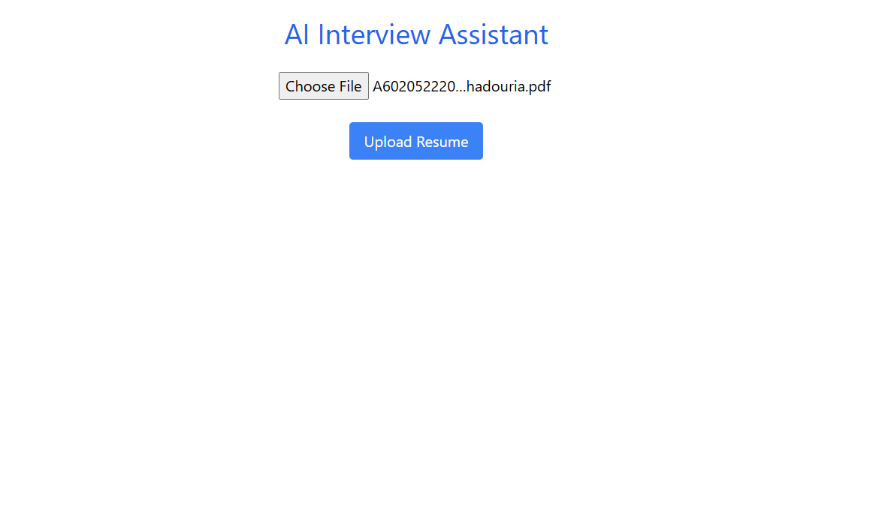
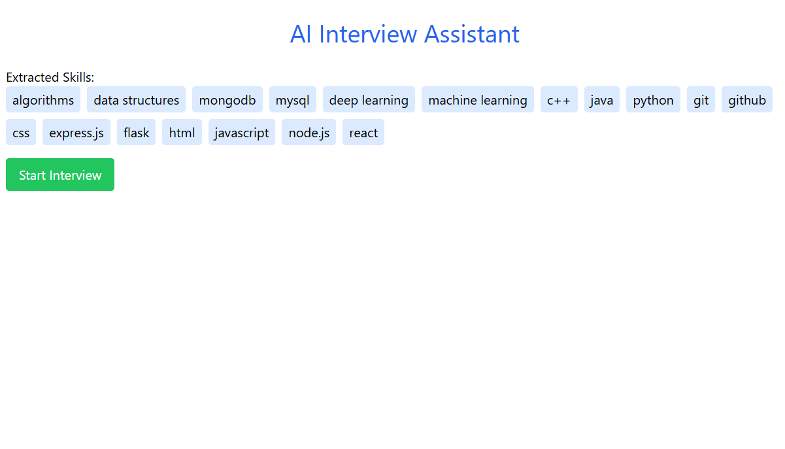
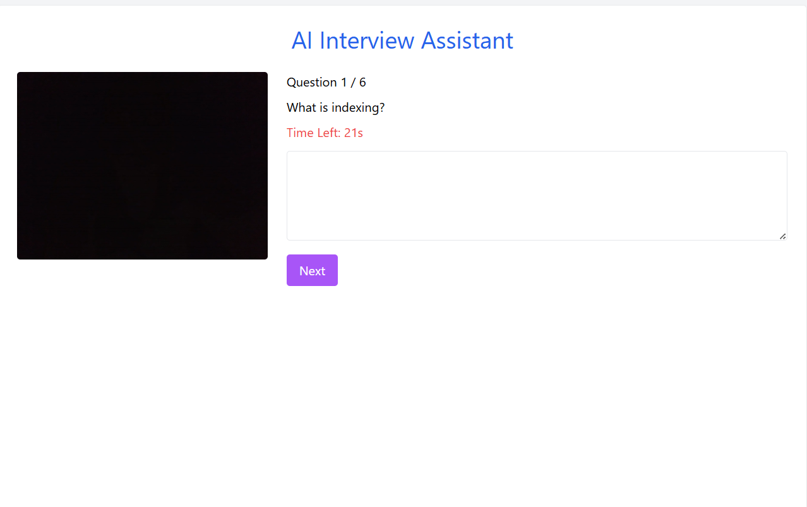
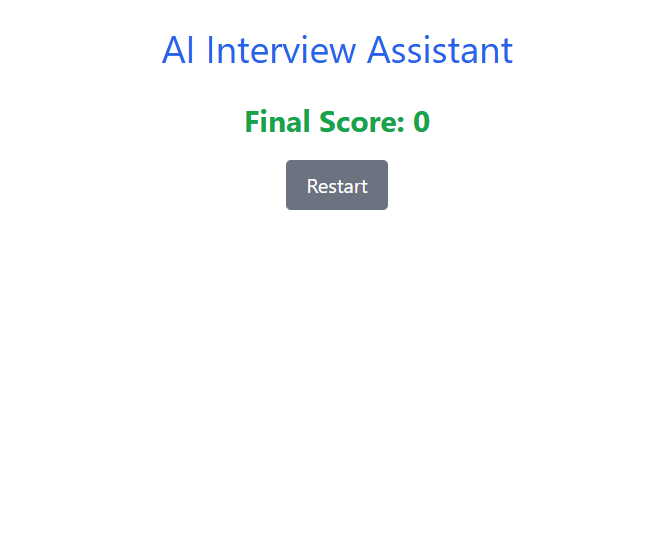

# 🤖 AI Interview Assistant

An AI-powered web application that conducts virtual interviews using voice interaction, evaluates responses, and predicts candidate performance.

---

## 🚀 Live Demo

* 🌐 Frontend: https://ai-interview-sage-iota.vercel.app
* ⚙️ Backend: https://aiinterview-production-902c.up.railway.app

---

## ✨ Features

* 📄 Resume Upload & Skill Extraction
* 🤖 AI-generated Interview Questions
* 🎤 Voice-based Answer Recording
* ⏱ Timer-based Interview Flow
* 📊 Automatic Evaluation & Score

---

## 🛠 Tech Stack

* Frontend: React (Vite), Tailwind CSS
* Backend: Flask (Python)
* AI: OpenAI API
* Deployment: Vercel + Railway

---

## 📸 Screenshots

### Upload Resume

### Extracted Skills

### Interview Screen

### Final Result

## 👨‍💻 Author

Aviral Bhadouria
